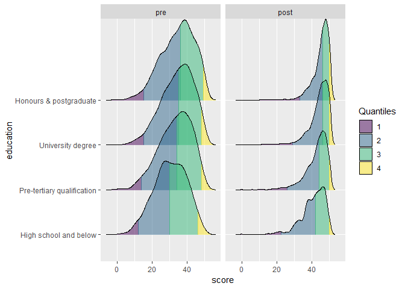
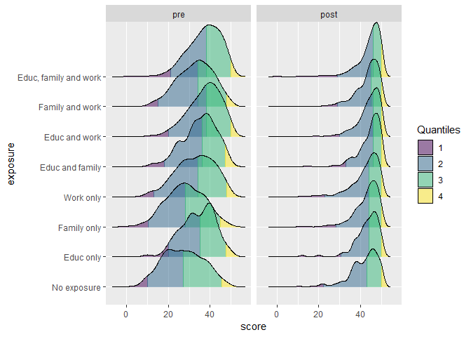
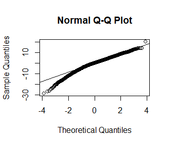

DKAS, multilevel linear regression 2016 & 2017 Statistical Appendix -
SUPPLEMENTARY MATERIALS
================
Bindoff, A., Eccleston, C.

2019-01-24

Data for 2016 and 2017 were cleaned, checked for duplicate subject IDs,
and converted to long-form for repeated-measures analysis. Special
attention was paid to ensuring that only pre-test scores that were
submitted before the participant had accessed MOOC content and only
post-test scores that were submitted after the participant had completed
all 3 units of the MOOC were included in the analysis. Incomplete cases
were
discarded.

### Density ridge plots

<!-- --><!-- -->

Fit a linear mixed effects model and check normality of residuals with
q-q
plot

``` r
m1 <- lmer(score ~ 0 + education + time + exposure + exposure:time + (1|subjectid) + (1|year), df0)

qqnorm(resid(m1))
qqline(resid(m1))
```

<!-- -->

### F-table for linear model

F statistics and degrees of freedom were estimated using the
Kenward-Roger approximation for Type III sums of squares implemented in
the `pbkr` R package \[1\]. This provides a conservative estimate for
mixed effects models with acceptable Type 1 error rates \[2\].

1.  Ulrich Halekoh, S?ren H?jsgaard (2014). A Kenward-Roger
    Approximation and Parametric Bootstrap Methods for Tests in Linear
    Mixed Models - The R Package pbkrtest. Journal of Statistical
    Software, 59(9), 1-30. URL <http://www.jstatsoft.org/v59/i09/>
2.  Luke, S. G. (2017). Evaluating significance in linear mixed-effects
    models in R. Behavior Research Methods, 49(4), 1494-1502.

<!-- end list -->

``` r
anova(m1, ddf = "Kenward-Roger")
```

    ## Type III Analysis of Variance Table with Kenward-Roger's method
    ##               Sum Sq Mean Sq NumDF  DenDF  F value    Pr(>F)    
    ## education      22056    5514     4    7.3  131.194 6.854e-07 ***
    ## time          142784  142784     1 4886.0 4245.557 < 2.2e-16 ***
    ## exposure       23895    3414     7 4882.2  101.501 < 2.2e-16 ***
    ## time:exposure  20663    2952     7 4886.0   87.772 < 2.2e-16 ***
    ## ---
    ## Signif. codes:  0 '***' 0.001 '**' 0.01 '*' 0.05 '.' 0.1 ' ' 1

``` r
summary(m1)
```

    ## Linear mixed model fit by REML. t-tests use Satterthwaite's method ['lmerModLmerTest']
    ## Formula: score ~ 0 + education + time + exposure + exposure:time + (1 |  
    ##     subjectid) + (1 | year)
    ##    Data: df0
    ## 
    ## REML criterion at convergence: 65818.9
    ## 
    ## Scaled residuals: 
    ##     Min      1Q  Median      3Q     Max 
    ## -4.9592 -0.4589  0.0784  0.5536  3.5260 
    ## 
    ## Random effects:
    ##  Groups    Name        Variance Std.Dev.
    ##  subjectid (Intercept) 18.53    4.305   
    ##  year      (Intercept)  2.75    1.658   
    ##  Residual              33.63    5.799   
    ## Number of obs: 9788, groups:  subjectid, 4894; year, 2
    ## 
    ## Fixed effects:
    ##                                         Estimate Std. Error        df t value Pr(>|t|)    
    ## educationHigh school and below           24.8010     1.2507    1.2762  19.829 0.015173 *  
    ## educationPre-tertiary qualification      26.2139     1.2377    1.2239  21.179 0.016078 *  
    ## educationUniversity degree               27.5839     1.2382    1.2256  22.278 0.015043 *  
    ## educationHonours & postgraduate          28.4586     1.2419    1.2407  22.915 0.013933 *  
    ## timepost                                 14.5898     0.4247 4885.9999  34.357  < 2e-16 ***
    ## exposureEduc only                         7.8517     0.8436 8647.9435   9.308  < 2e-16 ***
    ## exposureFamily only                       1.7162     0.4737 8616.4299   3.623 0.000293 ***
    ## exposureWork only                         5.4818     0.4438 8656.9270  12.352  < 2e-16 ***
    ## exposureEduc and family                   8.7080     0.5830 8563.1298  14.936  < 2e-16 ***
    ## exposureEduc and work                    10.7392     0.4682 8613.2882  22.939  < 2e-16 ***
    ## exposureFamily and work                   6.2546     0.4557 8607.5848  13.726  < 2e-16 ***
    ## exposureEduc, family and work            11.2853     0.4463 8469.9460  25.289  < 2e-16 ***
    ## timepost:exposureEduc only               -5.8072     0.9547 4885.9998  -6.083 1.27e-09 ***
    ## timepost:exposureFamily only              0.3714     0.5336 4885.9998   0.696 0.486518    
    ## timepost:exposureWork only               -4.8328     0.5030 4885.9998  -9.609  < 2e-16 ***
    ## timepost:exposureEduc and family         -5.2189     0.6519 4885.9998  -8.006 1.47e-15 ***
    ## timepost:exposureEduc and work           -7.8975     0.5272 4885.9998 -14.980  < 2e-16 ***
    ## timepost:exposureFamily and work         -3.9825     0.5127 4885.9998  -7.768 9.68e-15 ***
    ## timepost:exposureEduc, family and work   -7.5639     0.4926 4885.9998 -15.356  < 2e-16 ***
    ## ---
    ## Signif. codes:  0 '***' 0.001 '**' 0.01 '*' 0.05 '.' 0.1 ' ' 1

### Estimate 95% CIs with semi-parametric bootstrapping

As evidenced by density and Q-Q plots above, the assumptions of
normality of residuals and homogeneity of variance have been violated.
Because of these violations and the variance attributable to random
effects, a bootstrapping procedure was used to estimate 95% confidence
intervals.

``` r
df_pred <- expand.grid(education = levels(df0$education),
                       exposure = levels(df0$exposure),
                       time = levels(df0$time))

bootfit <- bootMer(m1, FUN=function(x) predict(x, df_pred, re.form = NA),
                   nsim = 10000,
                   use.u = TRUE,
                   type = "semiparametric",
                   parallel = "multicore",
                   ncpus = 3L)
df_pred$lwr <- apply(bootfit$t, 2, quantile, 0.025)
df_pred$upr <- apply(bootfit$t, 2, quantile, 0.975)
df_pred$fit <- apply(bootfit$t, 2, mean)
```

Mean and 95% CI for time variable (averaged over education and exposure)
and pairwise comparisons were calculated using a least-squares means
approach.

``` r
detach(package:lmerTest, unload = T)
library(lsmeans)

k <- lsmeans(m1, list(revpairwise ~ exposure|time))
summary(k, type = "response")
```

    ## $`lsmeans of exposure | time`
    ## time = pre:
    ##  exposure                lsmean       SE   df lower.CL upper.CL
    ##  No exposure           26.76436 1.231165 1.20 16.08556 37.44316
    ##  Educ only             34.61605 1.394686 1.97 22.51891 46.71319
    ##  Family only           28.48053 1.207415 1.11 18.00773 38.95334
    ##  Work only             32.24619 1.197524 1.07 21.85918 42.63320
    ##  Educ and family       35.47236 1.253839 1.29 24.59689 46.34783
    ##  Educ and work         37.50359 1.205960 1.10 27.04340 47.96377
    ##  Family and work       33.01900 1.200896 1.08 22.60274 43.43526
    ##  Educ, family and work 38.04969 1.196716 1.07 27.66969 48.42969
    ## 
    ## time = post:
    ##  exposure                lsmean       SE   df lower.CL upper.CL
    ##  No exposure           41.35417 1.231165 1.20 30.67538 52.03297
    ##  Educ only             43.39866 1.394686 1.97 31.30152 55.49580
    ##  Family only           43.44171 1.207415 1.11 32.96891 53.91452
    ##  Work only             42.00321 1.197524 1.07 31.61620 52.39022
    ##  Educ and family       44.84327 1.253839 1.29 33.96780 55.71874
    ##  Educ and work         44.19589 1.205960 1.10 33.73571 54.65608
    ##  Family and work       43.62636 1.200896 1.08 33.21010 54.04262
    ##  Educ, family and work 45.07562 1.196716 1.07 34.69562 55.45561
    ## 
    ## Results are averaged over the levels of: education 
    ## Degrees-of-freedom method: satterthwaite 
    ## Confidence level used: 0.95 
    ## 
    ## $`pairwise differences of contrast, time | time`
    ## time = pre:
    ##  contrast                                   estimate        SE      df t.ratio p.value
    ##  Educ only - No exposure                  7.85169122 0.8435865 8647.94   9.308  <.0001
    ##  Family only - No exposure                1.71617166 0.4736875 8616.43   3.623  0.0071
    ##  Family only - Educ only                 -6.13551956 0.8051287 8669.77  -7.621  <.0001
    ##  Work only - No exposure                  5.48182969 0.4438101 8656.93  12.352  <.0001
    ##  Work only - Educ only                   -2.36986152 0.7926173 8644.13  -2.990  0.0564
    ##  Work only - Family only                  3.76565803 0.3762506 8565.39  10.008  <.0001
    ##  Educ and family - No exposure            8.70799719 0.5830058 8563.13  14.936  <.0001
    ##  Educ and family - Educ only              0.85630597 0.8705429 8665.79   0.984  0.9768
    ##  Educ and family - Family only            6.99182553 0.5223193 8644.00  13.386  <.0001
    ##  Educ and family - Work only              3.22616750 0.5061376 8529.12   6.374  <.0001
    ##  Educ and work - No exposure             10.73922434 0.4681730 8613.29  22.939  <.0001
    ##  Educ and work - Educ only                2.88753312 0.8023333 8665.44   3.599  0.0077
    ##  Educ and work - Family only              9.02305268 0.3974811 8642.36  22.701  <.0001
    ##  Educ and work - Work only                5.25739465 0.3671876 8598.79  14.318  <.0001
    ##  Educ and work - Educ and family          2.03122715 0.5188548 8621.63   3.915  0.0023
    ##  Family and work - No exposure            6.25463900 0.4556680 8607.58  13.726  <.0001
    ##  Family and work - Educ only             -1.59705222 0.7946250 8668.67  -2.010  0.4751
    ##  Family and work - Family only            4.53846733 0.3815568 8656.92  11.895  <.0001
    ##  Family and work - Work only              0.77280930 0.3514553 8580.29   2.199  0.3524
    ##  Family and work - Educ and family       -2.45335820 0.5061287 8637.51  -4.847  <.0001
    ##  Family and work - Educ and work         -4.48458534 0.3741581 8664.03 -11.986  <.0001
    ##  Educ, family and work - No exposure     11.28532689 0.4462597 8469.95  25.289  <.0001
    ##  Educ, family and work - Educ only        3.43363567 0.7853989 8662.35   4.372  0.0003
    ##  Educ, family and work - Family only      9.56915523 0.3633810 8598.03  26.334  <.0001
    ##  Educ, family and work - Work only        5.80349720 0.3386715 8338.70  17.136  <.0001
    ##  Educ, family and work - Educ and family  2.57732970 0.4890387 8653.69   5.270  <.0001
    ##  Educ, family and work - Educ and work    0.54610255 0.3556619 8602.43   1.535  0.7883
    ##  Educ, family and work - Family and work  5.03068789 0.3381817 8608.14  14.876  <.0001
    ## 
    ## time = post:
    ##  contrast                                   estimate        SE      df t.ratio p.value
    ##  Educ only - No exposure                  2.04448758 0.8435865 8647.94   2.424  0.2299
    ##  Family only - No exposure                2.08753945 0.4736875 8616.43   4.407  0.0003
    ##  Family only - Educ only                  0.04305187 0.8051287 8669.77   0.053  1.0000
    ##  Work only - No exposure                  0.64903680 0.4438101 8656.93   1.462  0.8274
    ##  Work only - Educ only                   -1.39545078 0.7926173 8644.13  -1.761  0.6470
    ##  Work only - Family only                 -1.43850265 0.3762506 8565.39  -3.823  0.0033
    ##  Educ and family - No exposure            3.48909395 0.5830058 8563.13   5.985  <.0001
    ##  Educ and family - Educ only              1.44460637 0.8705429 8665.79   1.659  0.7136
    ##  Educ and family - Family only            1.40155450 0.5223193 8644.00   2.683  0.1277
    ##  Educ and family - Work only              2.84005715 0.5061376 8529.12   5.611  <.0001
    ##  Educ and work - No exposure              2.84171970 0.4681730 8613.29   6.070  <.0001
    ##  Educ and work - Educ only                0.79723212 0.8023333 8665.44   0.994  0.9755
    ##  Educ and work - Family only              0.75418025 0.3974811 8642.36   1.897  0.5527
    ##  Educ and work - Work only                2.19268290 0.3671876 8598.79   5.972  <.0001
    ##  Educ and work - Educ and family         -0.64737425 0.5188548 8621.63  -1.248  0.9175
    ##  Family and work - No exposure            2.27218863 0.4556680 8607.58   4.987  <.0001
    ##  Family and work - Educ only              0.22770105 0.7946250 8668.67   0.287  1.0000
    ##  Family and work - Family only            0.18464917 0.3815568 8656.92   0.484  0.9997
    ##  Family and work - Work only              1.62315183 0.3514553 8580.29   4.618  0.0001
    ##  Family and work - Educ and family       -1.21690532 0.5061287 8637.51  -2.404  0.2392
    ##  Family and work - Educ and work         -0.56953107 0.3741581 8664.03  -1.522  0.7957
    ##  Educ, family and work - No exposure      3.72144048 0.4462597 8469.95   8.339  <.0001
    ##  Educ, family and work - Educ only        1.67695290 0.7853989 8662.35   2.135  0.3921
    ##  Educ, family and work - Family only      1.63390103 0.3633810 8598.03   4.496  0.0002
    ##  Educ, family and work - Work only        3.07240368 0.3386715 8338.70   9.072  <.0001
    ##  Educ, family and work - Educ and family  0.23234653 0.4890387 8653.69   0.475  0.9998
    ##  Educ, family and work - Educ and work    0.87972078 0.3556619 8602.43   2.473  0.2069
    ##  Educ, family and work - Family and work  1.44925186 0.3381817 8608.14   4.285  0.0005
    ## 
    ## Results are averaged over the levels of: education 
    ## P value adjustment: tukey method for comparing a family of 8 estimates

``` r
lsmeans(m1, "time")
```

    ##  time   lsmean       SE   df lower.CL upper.CL
    ##  pre  33.26897 1.181754 1.02 18.83647 47.70148
    ##  post 43.49236 1.181754 1.02 29.05986 57.92487
    ## 
    ## Results are averaged over the levels of: education, exposure 
    ## Degrees-of-freedom method: satterthwaite 
    ## Confidence level used: 0.95
