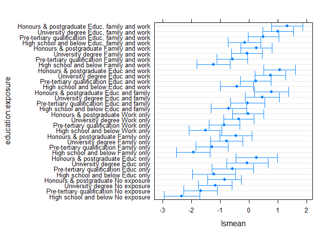
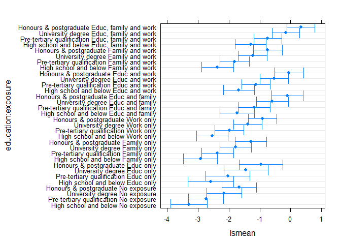
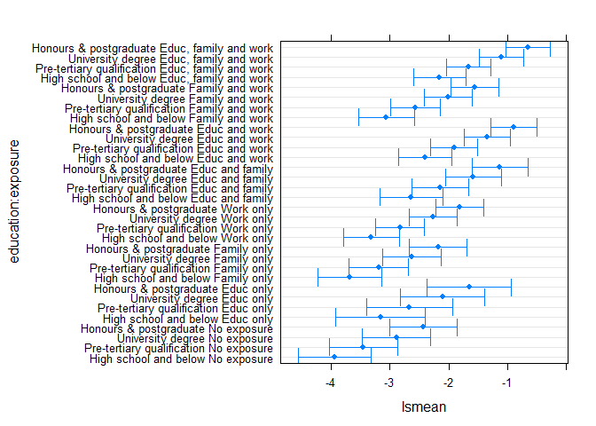

Sensitivity Analysis
================
Bindoff, A.

2019-01-24

## 

### Background and Summary of Results

An anonymous reviewer helpfully raised a question about the choice of
cut-off score used in the logistic regression. Investigators chose the
90th percentile of pre-test scores *before* the analysis because this
score was deemed to represent a very high level of dementia knowledge
within the community. However, the same argument could be made for any
percentile in the neighbourhood of the 90th percentile and this
*‘researcher degree of freedom’* could potentially have an effect on
the findings.

In order to make a quick assessment of the sensitivity of the results to
different cut-offs, models were fitted using the 50th, 80th, 85th, 90th,
and 95th percentiles of pre-test
scores.

``` r
quantile(filter(df0, time == "pre")$score, c(0.50, 0.80, 0.85, 0.90, 0.95))
```

    ##  50%  80%  85%  90%  95% 
    ## 34.5 42.0 44.0 45.0 47.0

We found that conclusions were robust to choice of these cut-offs.

### 50th percentile

Fit the logistic regression model, obtain p-values using a
likelihood-ratio test.

``` r
library(optimx)
m2 <- glmer(score ~ time + education + exposure + exposure:time +
              (1|subjectid) + (1|year), data = df0,
             family = binomial(link = logit), 
          control = glmerControl(optimizer ='optimx', optCtrl=list(method='nlminb')))

drop1(m2, test = "Chisq")
```

    ## Single term deletions
    ## 
    ## Model:
    ## score ~ time + education + exposure + exposure:time + (1 | subjectid) + 
    ##     (1 | year)
    ##               Df    AIC    LRT   Pr(Chi)    
    ## <none>           8718.8                     
    ## education      3 8813.0 100.19 < 2.2e-16 ***
    ## time:exposure  7 8832.9 128.12 < 2.2e-16 ***
    ## ---
    ## Signif. codes:  0 '***' 0.001 '**' 0.01 '*' 0.05 '.' 0.1 ' ' 1

<!-- -->

### 80th percentile

Fit the logistic regression model, obtain p-values using a
likelihood-ratio test.

``` r
m2 <- glmer(score ~ time + education + exposure + exposure:time +
              (1|subjectid) + (1|year), data = df0,
             family = binomial(link = logit), 
          control = glmerControl(optimizer ='optimx', optCtrl=list(method='nlminb')))

drop1(m2, test = "Chisq")
```

    ## Single term deletions
    ## 
    ## Model:
    ## score ~ time + education + exposure + exposure:time + (1 | subjectid) + 
    ##     (1 | year)
    ##               Df   AIC    LRT   Pr(Chi)    
    ## <none>           10032                     
    ## education      3 10177 151.05 < 2.2e-16 ***
    ## time:exposure  7 10128 110.11 < 2.2e-16 ***
    ## ---
    ## Signif. codes:  0 '***' 0.001 '**' 0.01 '*' 0.05 '.' 0.1 ' ' 1

<!-- -->

### 85th percentile

Fit the logistic regression model, obtain p-values using a
likelihood-ratio test.

``` r
m2 <- glmer(score ~ time + education + exposure + exposure:time +
              (1|subjectid) + (1|year), data = df0,
             family = binomial(link = logit), 
          control = glmerControl(optimizer ='optimx', optCtrl=list(method='nlminb')))

drop1(m2, test = "Chisq")
```

    ## Single term deletions
    ## 
    ## Model:
    ## score ~ time + education + exposure + exposure:time + (1 | subjectid) + 
    ##     (1 | year)
    ##               Df     AIC     LRT   Pr(Chi)    
    ## <none>            9861.0                      
    ## education      3 10057.2 202.182 < 2.2e-16 ***
    ## time:exposure  7  9938.9  91.889 < 2.2e-16 ***
    ## ---
    ## Signif. codes:  0 '***' 0.001 '**' 0.01 '*' 0.05 '.' 0.1 ' ' 1

<!-- -->

### 90th percentile

Fit the logistic regression model, obtain p-values using a
likelihood-ratio test.

``` r
m2 <- glmer(score ~ time + education + exposure + exposure:time +
              (1|subjectid) + (1|year), data = df0,
             family = binomial(link = logit), 
          control = glmerControl(optimizer ='optimx', optCtrl=list(method='nlminb')))

drop1(m2, test = "Chisq")
```

    ## Single term deletions
    ## 
    ## Model:
    ## score ~ time + education + exposure + exposure:time + (1 | subjectid) + 
    ##     (1 | year)
    ##               Df    AIC     LRT   Pr(Chi)    
    ## <none>           9534.2                      
    ## education      3 9758.5 230.221 < 2.2e-16 ***
    ## time:exposure  7 9598.6  78.342 2.999e-14 ***
    ## ---
    ## Signif. codes:  0 '***' 0.001 '**' 0.01 '*' 0.05 '.' 0.1 ' ' 1

<!-- -->

### 95th percentile

Fit the logistic regression model, obtain p-values using a
likelihood-ratio test.

``` r
m2 <- glmer(score ~ time + education + exposure + exposure:time +
              (1|subjectid) + (1|year), data = df0,
             family = binomial(link = logit), 
          control = glmerControl(optimizer ='optimx', optCtrl=list(method='nlminb')))

drop1(m2, test = "Chisq")
```

    ## Single term deletions
    ## 
    ## Model:
    ## score ~ time + education + exposure + exposure:time + (1 | subjectid) + 
    ##     (1 | year)
    ##               Df    AIC     LRT   Pr(Chi)    
    ## <none>           8066.3                      
    ## education      3 8246.5 186.126 < 2.2e-16 ***
    ## time:exposure  7 8090.5  38.148  2.84e-06 ***
    ## ---
    ## Signif. codes:  0 '***' 0.001 '**' 0.01 '*' 0.05 '.' 0.1 ' ' 1

<!-- -->
